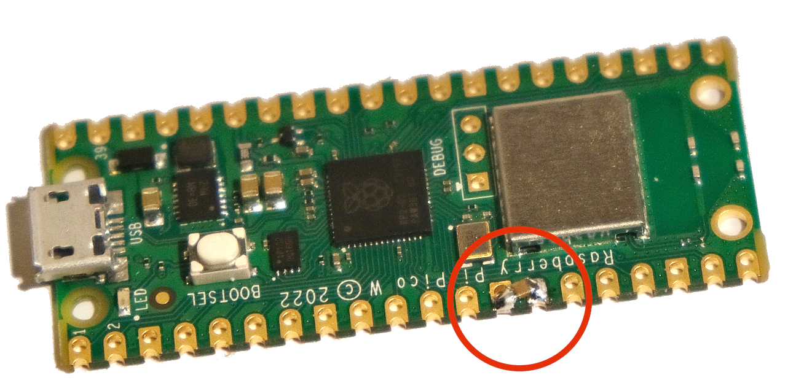

# RP2040 entropy source

This is a random number generator for a RP2040. It requires one hardware component,
a capacitor between a GPIO pin and ground. It should be treated as a proof of concept,
it requires further analysis before use in applications with consequences.

This is based on Peter Allan’s [twocent](https://github.com/alwynallan/twocents), with
half the component and pin count.

An end program would use [getrandom](https://docs.rs/getrandom) with `custom` feature,
see [rand](examples/rand.rs) example.

```rust
    caprand::setup(&mut p.PIN_10).expect("RNG setup failed");
    getrandom::register_custom_getrandom!(caprand::random);
    // ...
    let mut key = [0u8; 32];
    getrandom::getrandom(&key).unwrap();
```

## Operation

There is a capacitor between a GPIO pin and ground.
The capacitor is discharged briefly via the GPIO pin pulling low (1 cycle)
then the RP2040 internal pullup on that pin brings the capacitor high again.
It spins in a tight loop waiting for the pin to read as “high” input.

The time taken is measured to an exact system clock cycle (125MHz default), in
bursts of 5 bits (limited by number of registers).  That low order part of the
pullup time is output as a noise sample. Samples are hashed together
to form a seed, which seeds a [ChaCha20](https://docs.rs/rand_chacha/latest/rand_chacha/struct.ChaCha20Rng.html)
cryptographic DRBG.


## Security

The noise source has not been thoroughly quantified. Empirical testing seems
to show 1-2 bits per sample. As a workaround it takes 100 noise samples per bit of output,
hashing 25600 input noise samples to seed the DRBG.

Basic health tests (Adaptive Proportion and Repetition) are applied.

The hardware scheme has no protection against local interference (similar to the RP2040 itself).

## Hardware

Testing was performed with a 10nF Y5V SMD chip capacitor soldered between
GP10 pad and the adjacent GND pad, on a Pico W board.
Other capacitor values should also work OK - 100nF was tested, 1nF is likely to work.



## Examples

Examples must be built with `--features defmt`.

[rand](examples/rand.rs) uses getrandom as a normal program would.

[usbnoise](examples/usbnoise.rs) outputs raw samples as hex values, as a USB serial device

[sernoise](examples/sernoise.rs) outputs raw samples as hex values, as a USB serial device

